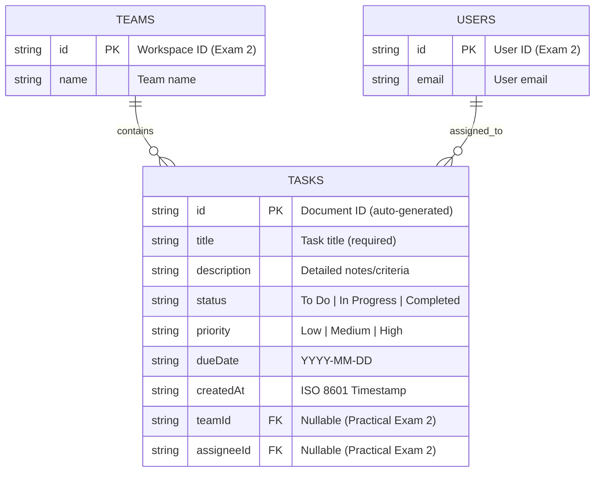

# TaskMaster Hub - Mobile Task Management App (Practical Exam 1)

[](https://github.com/USER/MMA301_AS/actions)

A modern mobile Task Management application built using **React Native (Expo SDK 57)** and connected to **Google Cloud Firestore**. Designed as the technical foundation for Practical Exam 1, with public CRUD operations (no authentication required) and ready for multi-tenant team features in Practical Exam 2.

---

## 📱 Features & Highlights

- **Project Scaffolding**: Modular TypeScript architecture adhering to clean separation of concerns (`screens/`, `components/`, `services/`, `hooks/`, `types/`, `navigation/`, `constants/`).
- **Cloud Firestore Real-time Sync**: Uses `onSnapshot` real-time listeners for instant synchronization across devices.
- **Full CRUD Capabilities**:
  - **Create**: Add tasks with title, description, status, priority, and due date.
  - **Read**: Live task feed with search filtering and category counts.
  - **Update**: Modal-based editing for task details and instant status toggle.
  - **Delete**: Soft/hard document removal with native confirmation dialog.
- **Bonus Enhancements**:
  - ✨ Client-side validation (title length, required fields, trim whitespace).
  - ✨ Status filtering (`All`, `To Do`, `In Progress`, `Completed`) with dynamic counters.
  - ✨ Keyword search filter across task titles and descriptions.
  - ✨ Pull-to-refresh integration with Firestore.
  - ✨ Automated CI pipeline (`.github/workflows/ci.yml`) running ESLint and TypeScript checks.
  - ✨ Responsive UI tailored for mobile phones and tablet viewports.
- **Future-Ready Milestones**:
  - Placeholder screens for **Teams** and **Profile** sections (to be implemented in Practical Exam 2).
  - Data model pre-configured with `teamId` and `assigneeId` fields.

---

## 🗄️ Firestore Data Model & Schema (ERD)

### Entity Relationship Diagram (Mermaid)



### Collection: `tasks` Schema Detail

| Field Name | Type | Required | Description |
| :--- | :--- | :--- | :--- |
| `id` | `string` | Yes | Firestore document ID (auto-generated) |
| `title` | `string` | Yes | Task title (client-validated, min 3 chars) |
| `description`| `string` | No | Task notes or acceptance criteria |
| `status` | `string` | Yes | Enum: `'To Do'` \| `'In Progress'` \| `'Completed'` |
| `priority` | `string` | Yes | Enum: `'Low'` \| `'Medium'` \| `'High'` |
| `dueDate` | `string` | Yes | Date string (e.g., `'2026-10-15'`) |
| `createdAt` | `string` | Yes | ISO 8601 creation timestamp |
| `teamId` | `string \| null` | No | Team identifier (reserved for Exam 2) |
| `assigneeId`| `string \| null` | No | Assignee user identifier (reserved for Exam 2) |

---

## 📂 Project Structure

```text
MMA301_AS/
├── .github/
│   └── workflows/
│       └── ci.yml               # GitHub Actions CI workflow
├── assets/                      # Application icons & splash screen
├── src/
│   ├── components/              # Reusable UI components
│   │   ├── EmptyState.tsx       # Placeholder when list is empty
│   │   ├── FilterTabs.tsx       # Status pill filters with counters
│   │   ├── Header.tsx           # Reusable app header
│   │   ├── TaskCard.tsx         # Task item card with actions
│   │   └── TaskModal.tsx        # Create & edit task modal dialog
│   ├── constants/
│   │   └── theme.ts             # Color palette, spacing, and radius tokens
│   ├── hooks/
│   │   └── useTasks.ts          # Custom hook with onSnapshot real-time sync
│   ├── navigation/
│   │   └── AppNavigator.tsx     # React Navigation bottom tabs
│   ├── screens/
│   │   ├── HomeScreen.tsx       # Public CRUD screen with task list
│   │   ├── ProfileScreen.tsx    # User profile placeholder (Exam 2)
│   │   └── TeamsScreen.tsx      # Teams & collaboration placeholder (Exam 2)
│   ├── services/
│   │   ├── firebase.ts          # Firebase app & Firestore initialization
│   │   ├── firebaseConfig.ts    # Config loader from environment
│   │   ├── firebaseConfig.example.ts # Configuration template
│   │   └── taskService.ts       # Firestore CRUD functions
│   └── types/
│       └── task.ts              # TypeScript interfaces for task data
├── .env.example                 # Environment variables template
├── .gitignore                   # Git ignore file (excludes secrets & builds)
├── .prettierrc                  # Prettier formatting configuration
├── App.tsx                      # Root application entry point
├── eslint.config.js             # ESLint configuration
├── package.json                 # Project dependencies & scripts
└── tsconfig.json                # TypeScript compiler configuration
```

---

## 🚀 Quick Start Guide

### 1. Prerequisites
- Node.js (v20+ recommended)
- npm or bun
- Expo Go on iOS / Android or Emulator

### 2. Installation
```bash
git clone <your-repository-url>
cd MMA301_AS
npm install
```

### 3. Configure Firebase
1. Create a project in [Firebase Console](https://console.firebase.google.com/).
2. Enable **Cloud Firestore** in test mode:
   ```javascript
   rules_version = '2';
   service cloud.firestore {
     match /databases/{database}/documents {
       match /{document=**} {
         allow read, write: if true;
       }
     }
   }
   ```
3. Copy `.env.example` to `.env` and fill in your keys:
   ```bash
   cp .env.example .env
   ```
   Or edit `src/services/firebaseConfig.ts` directly.

### 4. Running the App
```bash
# Start the Expo development server
npm start

# Run on Android emulator / device
npm run android

# Run on iOS simulator / device
npm run ios

# Run in Web browser
npm run web
```

### 5. Quality Checks & Verification
```bash
# Type checking
npm run typecheck

# Code style linting
npm run lint

# Code formatting
npm run format
```

---

## 📜 Commit History
The repository was built step-by-step with clean, meaningful commits:
1. `Initial commit`: Base Expo project setup
2. `chore: configure ESLint, Prettier, .gitignore and environment templates`
3. `chore: add .env.example template with Firebase keys`
4. `feat: define Task data model and application theme tokens`
5. `feat: configure Firebase SDK and implement Firestore CRUD service`
6. `feat: create useTasks hook with real-time onSnapshot listener and offline fallback`
7. `feat: add UI components for task cards, modals, filter tabs, and empty state`
8. `feat: implement HomeScreen with CRUD, Teams/Profile placeholders, and tab navigation`
9. `ci: add GitHub Actions CI workflow and documentation with ERD`
